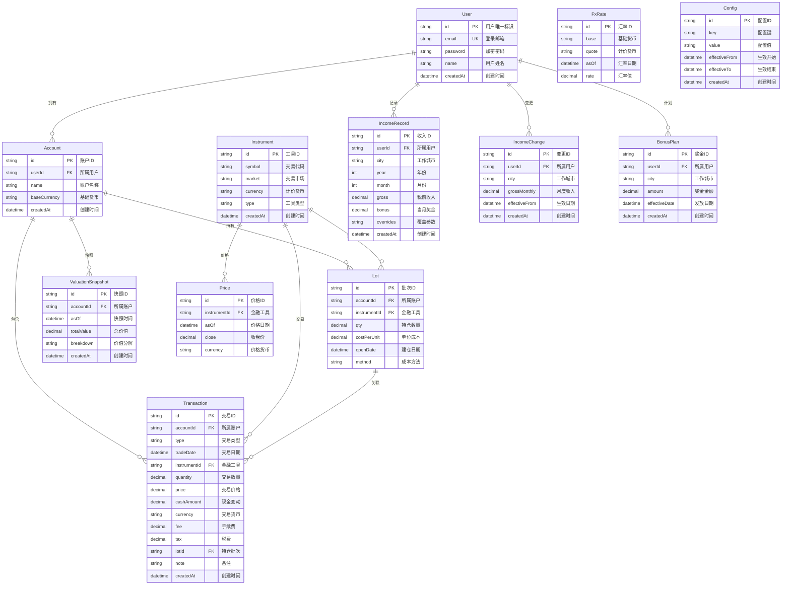

# 数据库表关联关系图

## 整体架构概述

这是一个个人财富管理系统的数据库设计，主要包含以下几个核心模块：

1. **用户管理模块** - User
2. **投资管理模块** - Account, Instrument, Transaction, Lot, ValuationSnapshot
3. **市场数据模块** - Price, FxRate
4. **收入管理模块** - IncomeRecord, IncomeChange, BonusPlan
5. **系统配置模块** - Config

## 表关联关系图



## 核心业务流程

### 1. 投资交易流程

```
用户 → 账户 → 交易记录 → 持仓批次
                ↓
         金融工具 ← 价格数据
```

### 2. 估值计算流程

```
持仓批次 + 最新价格 + 汇率 → 账户估值快照
```

### 3. 收入管理流程

```
用户 → 收入变更 → 月度收入记录 → 奖金计划
```

## 关键设计特点

### 数据完整性约束

- **唯一性约束**：
  - 用户邮箱全局唯一
  - 同一用户下账户名称唯一
  - 同一账户在同一时间点的估值快照唯一
  - 同一金融工具在同一日期的价格唯一
  - 同一货币对在同一日期的汇率唯一
  - 同一用户在同一年月的收入记录唯一

### 索引优化

- **性能索引**：
  - 金融工具按交易代码索引
  - 交易记录按账户和日期索引
  - 系统配置按键名索引
  - 收入变更按用户和生效日期索引
  - 奖金计划按用户和发放日期索引

### 灵活性设计

- **多货币支持**：账户、工具、交易都支持不同货币
- **扩展性配置**：Config 表支持 JSON 格式存储复杂配置
- **成本计算方法**：Lot 表支持 FIFO、LIFO 等多种成本计算方法
- **税务参数覆盖**：收入记录支持特殊税率参数

### 审计追踪

- 所有核心表都包含创建时间字段
- 交易记录保留完整的交易轨迹
- 收入变更记录薪资历史
- 估值快照记录账户价值变化

## 使用场景示例

1. **投资组合管理**：用户可以创建多个投资账户，记录买卖交易，系统自动计算持仓成本和收益
2. **业绩分析**：通过估值快照追踪账户价值变化，结合价格数据计算投资回报
3. **税务计算**：记录月度收入，结合城市税率参数计算个人所得税
4. **多货币支持**：支持港股、美股等外币投资，通过汇率表进行货币转换
5. **奖金规划**：记录奖金发放计划，用于收入预测和税务规划
