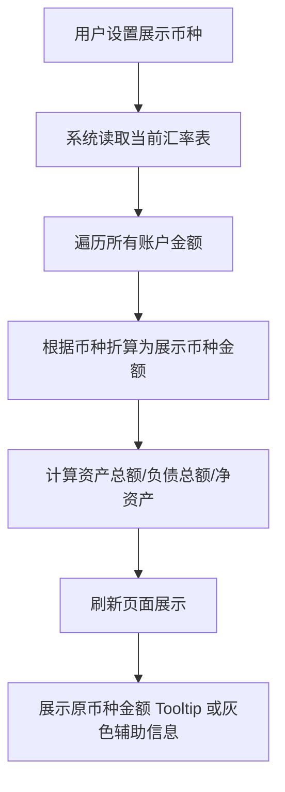

# 📓 Wealth Again 多币种账户与汇率系统需求蓝本（整合版）

## 1. 背景与定位

### 1.1 背景

现有账户模块已支持资产、负债、借贷等多类型账户，但金额仅以原币种展示，难以满足跨币种配置与统一汇总诉求。随着用户资产全球化、换汇与跨市场投资需求增长，需要引入多币种账户与汇率体系，支撑实时折算、历史回溯与透明报表。

### 1.2 产品定位

该模块是“个人财富与收入管理平台”的核心组件，负责账户管理、资产估值、跨币种汇总、换汇记录与报表投影，目标是提供 **简单、可报稿化、可回溯** 的账户体系，帮助用户在任意展示币种下理解资产全景与变动来源。

### 1.3 建设目标

- 多币种账户支持：允许创建 USD、CNY、HKD、EUR 等任意币种账户，统一管理与折算。
- 跨币种转账与换汇：提供镜像交易、汇率记录与手续费处理，保持本金与估值准确。
- 汇率统一换算：以 USD 为中间价完成展示币种折算；历史与当前汇率视图可切换。
- 报表透明可追溯：资产总额、净资产、收益率均可追溯到原币种金额与当时汇率。
- 低门槛运维：管理员可维护全局汇率、模拟登录排查，敏感操作写入审计日志。

---

## 2. 角色与权限

## 3. 核心模块与功能

### 3.1 账户生命周期

- 账户类型：储蓄（SAVINGS）、投资（INVESTMENT）、借贷（LOAN）、其他（OTHER）。
- 基础操作：新建、编辑、归档、恢复；创建时需指定账户币种与类型，后续不可修改。
- 估值规则：储蓄账户估值恒等于本金；投资与借贷账户允许录入估值快照，用于收益计算。
- 描述信息：支持 Markdown 描述，便于记录用途与限制。
- 归档约束：归档后禁止新增交易，但允许查询历史记录与导出。

### 3.2 交易与转账管理（TxnLine）

#### 3.2.1 交易类型

| 中文    | 枚举              | 描述                    |
| ----- | --------------- | --------------------- |
| 存入    | DEPOSIT         | 资金流入账户                |
| 取出    | WITHDRAW        | 资金流出账户                |
| 转账    | TRANSFER        | 任意两账户间转移资金（同币种/跨币种统一） |
| 调整    | ADJUSTMENT      | 手动调整余额                |
| 费用    | FEE             | 交易手续费或换汇成本            |
| 利息/收益 | INTEREST / GAIN | 自动或人工生成的收益记录          |

#### 3.2.2 跨币种统一模型

所有账户间资金流动均建模为 `TRANSFER`，系统自动生成两条镜像交易：来源账户金额为负，目标账户金额为正；汇率基于 USD 中间价计算并记录生效时间。

| 字段   | 来源账户     | 目标账户     |
| ---- | -------- | -------- |
| 交易类型 | TRANSFER | TRANSFER |
| 金额方向 | 负        | 正        |
| 币种   | 来源账户币种   | 目标账户币种   |
| 汇率   | 自动计算     | 同一汇率     |
| 汇率基准 | USD      | USD      |

> 同币种转账时汇率=1，不产生汇兑差；手续费 `FEE` 记录在付费账户，直接减少本金与估值。

#### 3.2.3 汇率计算与字段

```
rate(A → B) = rate(A → USD) × rate(USD → B)
```

- 任一币种为 USD 时直接使用单边汇率；币种相同则 rate=1。
- 交易数据需同时记录 `exchangeRateAB`、`viaCurrency="USD"`、`rateAtoUSD`、`rateUSDtoB`、`fxEffectiveAt`，保证回溯准确。

#### 3.2.4 本金与估值影响

- 来源账户：`principal -= amount`，`valuation -= amount`。
- 目标账户：`principal += amount × exchangeRate`，`valuation += amount × exchangeRate`。
- 转账不计入收益；如存在手续费，以独立 `FEE` 记录影响收益。

#### 3.2.5 交易记录展示

- 详情页以倒序表格展示日期、类型、原币种金额、折算金额、汇率、对方账户、备注与附件。
- 支持筛选（时间区间、金额区间、类型）、分页与 CSV/Excel 导出。
- 需保留对方账户名称与 ID，便于跨账户追溯。

### 3.3 汇率管理模块（FxRate）

- 以 USD 作为全局基准币种，仅维护 `1 USD = rate targetCurrency`。
- 支持手动录入与后续对接外部接口（OpenExchangeRates、ECB、中国银行等）。
- 汇率需设置 `effectiveFrom`、`effectiveTo`，禁止同一币种区间重叠；缺失时阻止跨币种交易。
- 除了历史交易中的汇率快照，汇率信息只维护最新的汇率数据

### 3.4 展示币种设置与折算逻辑

- 用户可在账户页与 `/settings` 设置展示币种；默认采用个人偏好。
- 系统在渲染列表、详情、Dashboard、报表时，将原币种金额折算为展示币种并同步展示原币种值。
- 折算公式：

```js
accountValueInDisplay = value × rate(account.baseCurrency→USD) × rate(USD→displayCurrency)
```

- 汇总指标：

```
资产总额 = Σ(账户余额 × 汇率)
负债总额 = Σ(负债账户余额 × 汇率)
净资产 = 资产总额 - 负债总额
ROI = (当前估值折算金额 - 累计本金折算金额) ÷ 累计本金折算金额
```

- 示例（展示币种为 CNY）：
  - A 账户（USD）余额 $500，汇率 1 USD = 7.14 CNY。
  - B 账户（CNY）余额 ¥500。
  - 资产总额 = $500 × 7.14 + ¥500 = ¥4070。

### 3.5 估值与可视化

- 账户详情页展示本金与估值走势折线图，支持 1 个月、3 个月、1 年、全部时间范围。
- 曲线：蓝线（累计本金）、绿线（账户估值）、可选红线（收益）。
- 支持切换“历史汇率视图”（按交易时汇率还原）与“当前汇率视图”（按最新汇率重算）。
- 数据来源：`TxnLine`、`ValuationSnapshot` 聚合，结合汇率快照生成时间序列数据点。

### 3.6 报表与历史回溯

- 汇率变动触发净资产波动；系统在每次交易与估值写入时保存对应汇率，确保报表可回溯。
- 支持导出账户列表、净资产趋势、资产分布等报表，过滤条件包含时间范围、交易类型、展示币种。
- 历史报表可切换“当前汇率”与“历史汇率”两种视图，以区分资产涨跌与汇兑影响。

---

## 4. 数据模型与字段

### 4.1 Account 表结构

```prisma
model Account {
  id             String   @id @default(uuid())
  userId         String
  name           String
  accountType    String   // Enum: SAVINGS | INVESTMENT | LOAN | OTHER
  baseCurrency   String   // ISO-4217: USD, CNY, HKD, EUR...
  initialBalance Decimal  @default(0)
  subType        String?
  description    String?  // 账户详细说明，可支持 Markdown
  status         String   @default("ACTIVE") // ACTIVE | ARCHIVED
  createdAt      DateTime @default(now())
  updatedAt      DateTime @updatedAt

  user       User                @relation(fields: [userId], references: [id])
  txnLines   TxnLine[]
  valuations ValuationSnapshot[]

  @@index([userId])
}
```

### 4.2 TxnLine 核心字段

- `id`、`accountId`、`counterpartyAccountId`、`counterpartyName`
- `type`（DEPOSIT / WITHDRAW / TRANSFER / FEE / ADJUSTMENT / INTEREST / GAIN）
- `amount`、`currency`、`exchangeRateAB`、`viaCurrency`、`rateAtoUSD`、`rateUSDtoB`
- `fxEffectiveAt`、`occurredAt`、`remark`、`attachmentUrl`
- `principalDelta`、`valuationDelta`（方便报表聚合）
- `createdBy`、`createdAt`

### 4.3 ValuationSnapshot 与 FxRate

- `ValuationSnapshot`：记录账户估值、估值币种、估值时间、来源（手动/接口）、备注。
- `FxRate`：参考 3.3 表结构；系统需保证查询某日期最新有效记录。

---

## 5. 业务规则与校验

1. 账户类型与币种创建后不可修改；归档账户禁止新增交易或估值。
2. 跨币种交易必须存在对应生效汇率，否则前端阻止提交，后端返回 422。
3. 汇率区间禁止重叠；新建与编辑时需校验 `effectiveFrom` / `effectiveTo`。
4. 转账必须写入对方账户信息；系统需保证镜像交易成对存在，缺失时阻止提交。
5. 手工调整 `ADJUSTMENT` 需记录操作者与原因，并写入 `AuditLog`。
6. 敏感操作（汇率维护、账户删除、模拟登录编辑）统一写入 `AuditLog`，包含操作者 ID、时间、内容。

---

## 6. 交互与展示

- 账户列表：展示账户名、账户类型、原币种金额、折算金额、累计本金、收益、ROI；底部汇总资产总额、负债总额与净资产。
- 账户详情：顶部展示账户元数据，中部为交易记录表，底部展示估值与本金折线图。
- 展示币种设置：页面顶部提供选择器，并提示当前汇率快照日期；切换后触发 SWR 重新拉取折算结果。
- 操作流程示意：



---

## 7. 非功能性要求

- **准确性**：所有计算可重算并保持与历史配置一致；支持回溯验证。
- **性能**：支撑 10 年以上交易数据，Dashboard 加载时间 < 2s（缓存 + 分页）。
- **安全性**：管理员操作需双重确认；敏感操作写入审计日志。
- **扩展性**：支持新币种、新汇率来源、新账户类型，无需大规模改动。
- **可用性**：前端采用 shadcn/ui + Tailwind，支持深浅色模式与无障碍。

---

## 8. 交付与验收

- 跨币种转账金额、汇率记录、本金与估值变动均准确且可回溯。
- 汇总折算与原币种金额一致，ROI 计算正确。
- 交易记录包含对方账户、汇率、手续费等关键字段，并支持导出。
- Dashboard 与账户模块展示的资产、负债、净资产、收益率一致。
- 演示 `doc/prd-income.md` 示例数据场景，确保汇率缺失时阻止提交、提示补录。

---

## 9. 未来扩展方向

1. 汇率自动更新接口：OpenExchangeRates、ECB、中国银行等多源数据聚合。
2. 投资标的多币种估值：股票、基金、期权等，拆分资产变动与汇率影响。
3. 汇率变动收益归因：区分资产涨跌收益与汇兑收益，提供净值归因分析。
4. 多币种现金流分析：按币种维度输出现金流量表，支持预算对比。
