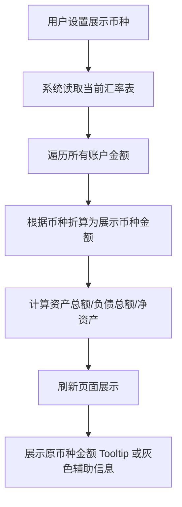

下面是一份完整、专业的《多币种账户与汇率系统业务需求说明书（BRD）》草稿，基于你提供的 Wealth Again 页面结构与使用逻辑编写，已结合你提到的计算示例、页面交互方式与真实世界金融场景。

---

# 🧾 Wealth Again 多币种账户与汇率系统业务需求说明书（BRD）

## 一、背景与目标

当前系统的账户模块已支持“资产”“负债”“借贷”等不同类型账户的独立记录与展示，但所有金额均以账户原始币种展示。随着用户的跨币种资产配置需求（如美元账户、港币账户、人民币贷款）增加，需要引入多币种体系，实现以下目标：

1. **多币种账户支持**：支持不同币种的账户（如 USD、CNY、HKD、EUR 等），并能统一汇总。
2. **多币种转账与换汇记录**：支持跨币种转账、内部换汇交易。
3. **汇率统一换算**：所有统计（资产总额、负债总额、净资产、收益率等）均根据用户设置的展示币种进行实时换算。
4. **历史汇率管理**：汇率每日更新并支持手动录入，以便还原历史资产净值。
5. **汇率透明展示**：在每个账户的明细展示中，需体现“原始币种金额 + 折算展示币种金额”。

---

## 二、系统模块与功能点

### 1. 汇率管理模块

#### 功能说明：

- 维护不同币种对**基准币种（默认 USD）**的汇率。
- 支持：

  - 自动同步（未来可接第三方 API）
  - 手动录入（指定汇率、生成日期）

- 展示“最新汇率日期”和状态（已设置/缺失）。

#### 示例：

| 币种 | 基准币种 | 汇率 (1 USD = X CNY) | 生效日期   | 状态   |
| ---- | -------- | -------------------- | ---------- | ------ |
| CNY  | USD      | 7.1400               | 2025-10-12 | 已设置 |
| HKD  | USD      | 7.8300               | 2025-10-12 | 已设置 |
| EUR  | USD      | 0.9300               | 2025-10-12 | 已设置 |

---

### 2. 用户展示币种设置

#### 功能说明：

- 用户可在账户页顶部设置“展示币种”（如：CNY、USD、HKD）。
- 设置后，系统将：

  1. 将所有账户资产、负债、收益等金额统一换算为展示币种；
  2. 在明细中同时显示原币种与折算金额；
  3. 重新计算资产总额、负债总额与净资产。

#### 示例：

- **用户设置展示币种为 CNY**

  - A 账户（USD）余额 500$
  - B 账户（CNY）余额 ¥500
  - 汇率：1 USD = 7.14 CNY
  - **资产总额 = 500 × 7.14 + 500 = ¥4070**

---

### 3. 账户列表与资产总览展示

#### 展示逻辑：

1. 所有账户金额均折算为“展示币种”；
2. 同时在账户详情中保留“原币种金额”。

#### 页面展示示例：

| 账户名       | 币种 | 当前估值（折算） | 原币种金额 | 累计本金（折算） | 收益（折算） | ROI   |
| ------------ | ---- | ---------------- | ---------- | ---------------- | ------------ | ----- |
| 花旗银行储蓄 | USD  | ¥3,570.00        | $500.00    | ¥3,570.00        | ¥0.00        | 0.00% |
| 建设银行理财 | CNY  | ¥10,000.00       | ¥10,000.00 | ¥10,000.00       | ¥0.00        | 0.00% |
| **资产总额** |      | **¥13,570.00**   |            |                  |              |       |

---

### 4. 跨币种转账与换汇

#### 功能说明：

支持不同币种间的转账/换汇操作，系统自动生成两条对称记录：

- 来源账户：支出 + 原币种
- 目标账户：收入 + 目标币种
- 汇率按当日或用户指定录入的汇率计算。

#### 示例：

用户将「USD 账户」的 $100 转入「CNY 账户」，汇率为 7.14

- USD 账户：支出 $100
- CNY 账户：收入 ¥714
- 系统自动标记“跨币种转账”类型，保留汇率记录。

---

### 5. 总体汇总逻辑

#### 汇总公式：

- **资产总额** = Σ(账户余额 × 账户币种对展示币种汇率)
- **负债总额** = Σ(账户负债 × 账户币种对展示币种汇率)
- **净资产** = 资产总额 - 负债总额
- **收益率 (ROI)** = (当前估值折算金额 - 累计本金折算金额) ÷ 累计本金折算金额

#### 示例：

| 账户       | 币种 | 当前估值 | 折算后     | 累计本金 | 折算本金 | 收益 | ROI   |
| ---------- | ---- | -------- | ---------- | -------- | -------- | ---- | ----- |
| USD 储蓄   | USD  | $500     | ¥3,570     | $500     | ¥3,570   | ¥0   | 0.00% |
| RMB 理财   | CNY  | ¥10,000  | ¥10,000    | ¥10,000  | ¥10,000  | ¥0   | 0.00% |
| 借款       | CNY  | ¥10,000  | ¥10,000    | ¥10,000  | ¥10,000  | ¥0   | 0.00% |
| **净资产** |      |          | **¥3,570** |          |          |      |       |

---

### 6. 历史还原与报表支持

#### 功能说明：

- 汇率变动会导致折算值波动；
- 为了保持报表可回溯，系统在每次记录资产变动时，保存当时汇率；
- 历史报表（如每月净资产曲线）基于当时汇率还原；
- 用户可切换“当前汇率视图”与“历史汇率视图”。

---

## 三、交互逻辑（简化流程）

---

## 四、未来扩展方向

1. **汇率自动更新接口**：接入 OpenExchangeRates、ECB、中国银行等数据源。
2. **多币种投资品估值**：如持仓中股票、基金等标的，以币种+市场汇率动态计算。
3. **跨币种收益归因分析**：区分“资产涨跌收益”和“汇率变动收益”。
4. **多币种现金流分析**：支持多币种现金流并汇总为展示币种。

---

## 五、总结

通过本需求的实现：

- 用户可以自由选择展示币种；
- 系统可透明展示“原币种 + 折算币种”；
- 汇率变化实时影响资产统计；
- 跨币种转账与收益分析逻辑一致；
- 所有报表可追溯至历史汇率，还原真实的财务状态。

---

是否希望我帮你继续生成这一版的 **前端与后端字段设计文档（包含接口字段结构与汇率换算逻辑示例）**？
那样可以直接指导开发实现这一整套多币种体系。
