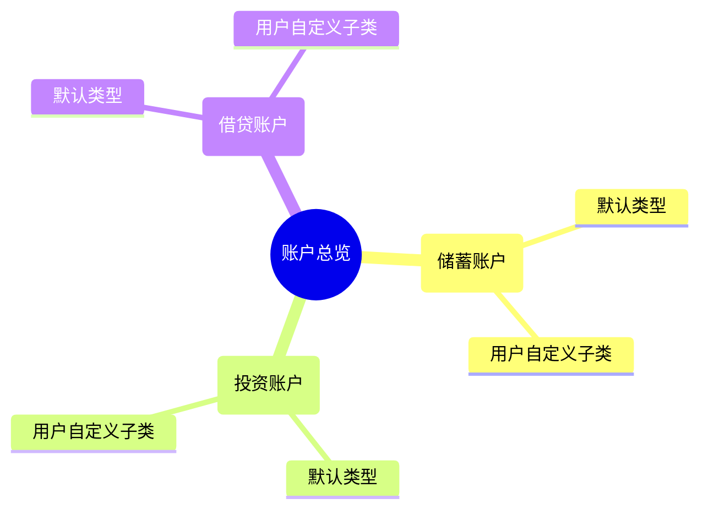
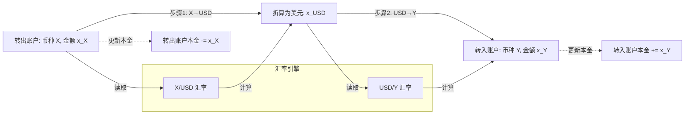
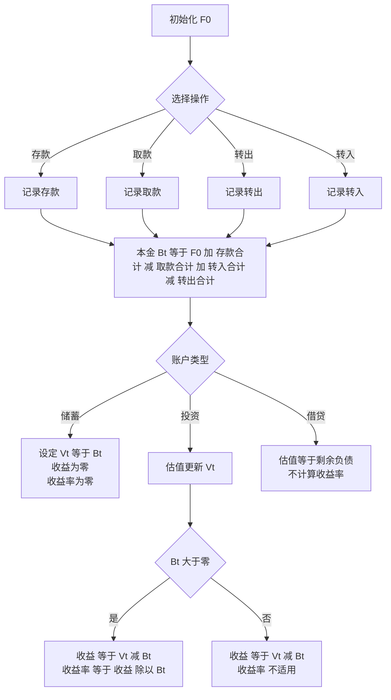
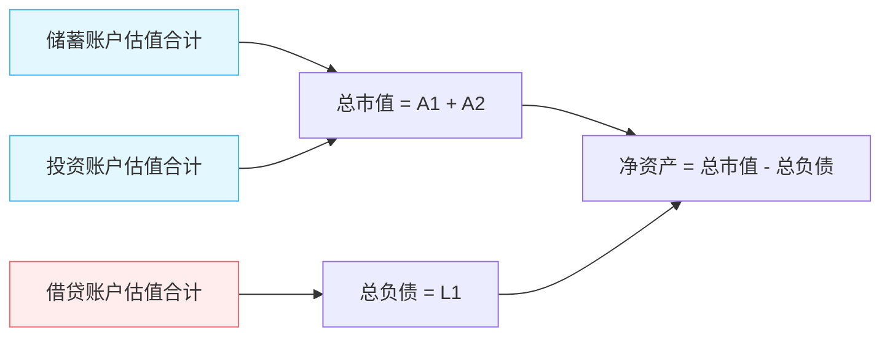
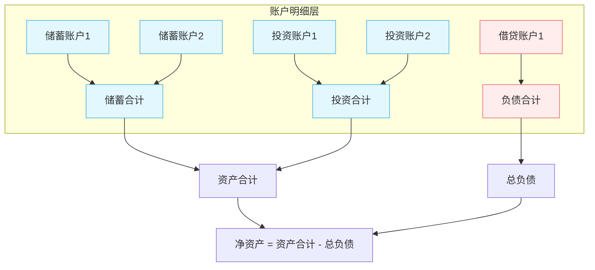

# 个人资产账户管理需求文档（含流程图）

## 一、目标

- 管理个人全部资产与负债账户，快速了解“我现在有多少钱”、“这些钱由哪些部分构成”、“投资账户收益如何”。
- 支持 **多币种账户**（人民币、美元、港元等），统一折算为用户默认展示货币。
- 保持简洁：无需记录证券/基金代码，只在账户级别管理（本金操作 + 估值记录）。

---

## 二、账户体系

### 账户分类

- **三大类账户**：

  1. **储蓄账户（流动资金）**：本金 = 估值，不存在波动（如活期、定期、黄金、现金）
  2. **投资账户（长期资金）**：估值 ≠ 本金，需定期更新估值（如基金账户、股票账户、不动产、加密货币）
  3. **借贷账户（负债）**：估值 = 剩余负债，作为负值计入资产负债表（如房贷、车贷、信用卡）

- **子类账户**：用户可自定义（如“储蓄 → 黄金”），也可不建（使用默认分类）。

#### 账户层级关系（Mermaid）

## 三、账户功能需求

1. **新建账户**

   - 输入：账户名称、账户类型、**币种**（默认 CNY，可选 USD/HKD 等）、初始金额、备注
   - 初始金额即初始本金与初始估值（储蓄账户恒等）

2. **编辑账户**

   - 可修改名称、分类、备注
   - **币种不可更改**（避免历史记录混乱）
   - 初始金额回溯修改需有日志

3. **删除/归档账户**

   - 无历史记录：允许删除
   - 有历史记录：仅可**归档**，保留历史（保障报表连续性）

4. **账户转账**

   - **同币种**：直接金额划转，本金减少/增加
   - **跨币种**：以 **USD 作为中间价**

     - 金额（A 币种）→ 先换算 USD → 再换算 B 币种 → 更新两账户本金

5. **账户存取款**

   - 存款：本金增加（外部资金流入）
   - 取款：本金减少（外部资金流出）

6. **账户估值**

   - 可在任意时间设置估值
   - **储蓄**：估值 = 本金
   - **投资**：估值手动更新，反映市值
   - **借贷**：估值 = 剩余负债，随还款减少

7. **收益计算**

   - 本金 = 初始资金 + ∑ 存款 – ∑ 取款
   - 收益 = 当前估值 – 本金
   - 收益率 = 收益 ÷ 本金
   - 储蓄：收益恒为 0；借贷：不计算收益率（直接负债）

8. **账户报表**

   - 账户维度：本金、估值、收益、收益率；收支明细（存取款/转账/估值）
   - 分类维度：储蓄合计、投资合计、借贷合计

9. **账户变动日志**

   - 全量记录：存款、取款、转账、估值更新
   - 支持按时间、账户、操作类型筛选

---

## 四、多币种支持

### 1) 账户层面

- 每个账户固定一个 **账户币种**；账户内的存取款和估值均以该币种记录。

### 2) 跨币种转账（以 USD 为中间价）

> 计算公式示意：
> `x_USD = x_X / (X/USD 报价)` > `x_Y   = x_USD * (USD/Y 报价)`
> 注意四舍五入与最小金额单位（如分）处理，避免累计误差。

### 3) 展示与折算

- 展示默认使用 **用户设置的默认币种**（如 CNY）
- 任一账户若币种 ≠ 默认币种 → 根据汇率折算后展示
- 用户可在总览界面临时切换展示币种（CNY / USD / HKD）

### 4) 资产计算口径（统一币种）

- **总市值** = ∑ 资产账户估值（折算为默认币种）
- **总负债** = ∑ 借贷账户估值（折算为默认币种）
- **净资产** = 总市值 – 总负债

---

## 五、核心计算流程图

### 1) 本金与收益计算（账户内）

### 2) 净资产计算（全局）

---

## 六、总览页面（Dashboard）

### 核心指标

- 总市值 / 总负债 / 净资产
- 流动资金（储蓄账户合计）
- 长期资金（投资账户合计）
- 借贷资金（借贷账户合计）

### 可视化

- **资产负债表**（资产 vs 负债、净资产突出）
- **净资产趋势**（按月/季度/年）
- **资产占比**（储蓄/投资/借贷），支持下钻至自定义子类

#### 总览数据聚合关系（Mermaid）

---

## 七、专业性补充（保持简洁但不缺关键）

- **归档机制**：账户关闭/合并后归档，保留历史，确保报表连续性
- **汇率管理**：支持手动录入与定期更新；保留每次换算时点的汇率（用于追溯）
- **数据追溯**：所有变动有时间戳、操作类型、金额、币种、备注
- **风险提示**：投资账户估值若超过阈值时间未更新，提醒用户
- **精度与四舍五入**：按币种最小货币单位处理，避免累计误差
